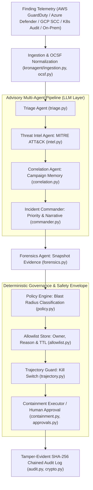

# Kronagent

**Autonomous AI threat-defense for enterprise networks — with guardrails you can audit.**

Kronagent is an AI-native security platform built as a team of specialist agents: it ingests live findings from multi-cloud and cluster environments, triages and investigates them, synthesizes an incident assessment, preserves forensic evidence, and executes containment — with **graduated autonomy**, not blanket automation. Every decision is gated by a deterministic policy engine, every action is planned and logged before it runs, destructive actions always wait for a human, and the entire trail is a tamper-evident, hash-chained audit log.

Most "AI SOC" tools stop at investigation. Kronagent executes — but only as much
autonomy as it has earned.

```bash
./demo.sh          # see it work, end to end, in your terminal
```

---

## Why it's built this way

The pitch for autonomous security response is easy; the trust model is the
hard part. Kronagent's answer is **earn-trust, graduated autonomy**:

- **Safe by default.** On a cold start, the auto-execute allowlist is empty.
  Every containment action requires human approval until an operator
  explicitly promotes it — and that promotion is itself audited (who, when,
  why).
- **Trust is re-earned, not inherited.** A promotion can carry a TTL
  (`--expires-in 90d`) and names an **owner** — the person accountable for it
  now, asked to renew it, and reassignable as people change teams (distinct
  from the immutable record of who promoted it and why). When the TTL lapses
  the class routes back to human approval, and the lapse is recorded in the
  audit chain like any other governance decision. The expiry, not the review,
  is what does the work: **a review fails open — silence reads as approval —
  while an expiry fails closed**, so inattention withdraws autonomy instead of
  extending it. (Badge permissions on regulated sites are built the same way:
  an owner and an expiry, and it's the expiry that carries the weight.)
  `promote.py review` is the prompt, not the control — it prints each entry
  with its owner, original reason, and whether it has ever actually fired, and
  `promote.py warn-expiring` (cron) tells each owner once, ahead of time, that
  theirs is about to lapse. Neither can keep an entry alive; if the warning
  never arrives, the entry still expires on schedule.
- **An owner who leaves takes the autonomy with them.** With an operator
  registry configured, an entry stops granting autonomy the moment its owner
  is removed, deactivated, loses the promote permission, or loses access to
  the tenant — judged on every decision, in the tenant the action runs in.
  The pipeline then records a suspension in the audit chain. Adding the person
  back to the registry does not undo it; only a renewal, or a reassignment to
  someone in standing, does. And no one can be made an owner who couldn't
  renew the entry. Without a registry (or with OIDC alone, which has no
  directory to ask), owner standing is not checked, and `run_preflight.py`
  says so rather than passing it.
- **A promotion covers the action as it was classified.** Each entry pins the
  policy table's classification (reversible, blast radius, destructive) on the
  day it was promoted. If the table later changes that class in either
  direction, the entry stops granting autonomy and is suspended, and only a
  renewal lifts it. Otherwise a class promoted while classified destructive
  (recorded but inert behind the ceiling) would go live unattended the day the
  table relaxed it.
- **The policy engine is the hard ceiling, not a suggestion.** Actions are
  classified by reversibility and blast radius. Destructive or wide-blast
  actions (terminate an instance, delete a pod, scale a deployment to zero)
  are *structurally* incapable of running unattended — promoting one to the
  allowlist by mistake has no effect; the classification table wins.
- **LLMs reason, they never act.** Every agent's output schema is
  constructed so it cannot express a containment target or action class.
  Targets always come from the normalized finding data, never from a model —
  so a prompt-injection payload in telemetry cannot redirect an action onto
  an attacker-chosen resource.
- **Nothing is invisible.** Every decision — triage, policy, containment,
  approval, governance, forensics — is one entry in an append-only,
  SHA-256-chained audit log. Editing a past record breaks verification of
  every record after it. This is what makes an autonomous response
  defensible instead of a black box (and maps directly onto EU AI Act
  Article 12 automatic logging and Article 14 human oversight).

See [`agent-team-architecture.md`](agent-team-architecture.md) for the full
design rationale.

---

## The agent team

| Agent | Type | Role |
|---|---|---|
| **Triage** | LLM | Is this finding a real, actionable threat? |
| **Threat Intelligence** | LLM | Maps the finding to MITRE ATT&CK; assesses indicators of compromise |
| **Investigation / Correlation** | LLM, with memory | Is this part of a larger campaign? Correlates against recent findings |
| **Incident Commander** | LLM | Synthesizes the above into one narrative, a priority (P1–P4), and an escalation decision |
| **Forensics** | Deterministic | Preserves evidence (EBS snapshots, pod logs/manifests) with chain of custody — *before* containment can destroy it |

Every LLM agent is purely **advisory**: it enriches the incident record and
the human's approval context, and never touches the policy decision. Only two
layers can cause a side effect — the deterministic **policy engine** (decides
whether an action may run) and **containment** (executes it, or doesn't).




---

## What it actually does

- **Multi-provider detection.** Five substrates — AWS (GuardDuty — IAM/EC2),
  Azure (Defender for Cloud — VMs/Entra ID), GCP (Security Command Center —
  service accounts/Compute), Kubernetes (audit events — pods/nodes/deployments)
  and in-house/on-premises (hosts/accounts/processes) — normalize into one
  provider-neutral `Finding` type and flow through the identical pipeline.
  Adding another source is a new module in `kronagent/providers/` plus a
  registry entry; nothing above that seam changes. Because on-premises
  infrastructure has no vendor schema to normalize, that provider defines a
  small **ingestion contract** instead, and detectors (Wazuh, Falco, Suricata,
  syslog) map onto it.
- **Live ingestion.** GuardDuty → EventBridge → SQS, long-polled with
  at-least-once, ack-after-process delivery — a crash mid-processing
  redelivers the finding rather than losing it.
- **Real containment, planned before it runs.** Every action — disable an
  IAM key, isolate an instance/pod, block an IP, cordon a node — computes its
  exact API calls and rollback plan first, always, whether it executes,
  waits for approval, or is blocked.
- **Human approval that happens before the side effect**, not a retrospective
  log — reviewed with the full context (triage verdict, ATT&CK mapping,
  campaign correlation, evidence collected) and executed through the same
  path an autonomous action would take.
- **Governance with an audit trail.** Promoting an action class to
  autonomous execution is a CLI command, not an environment-variable edit —
  it's persisted, takes effect immediately (no restart), and is
  hash-chained into the audit log.

---

## Getting started

Three steps, in order. Each one is useful on its own, and nothing you do in
step 1 or 2 can touch your infrastructure.

### 1. See it work — 2 minutes, no cloud account, no API key

```bash
python3 -m pip install -r requirements.txt
python3 run_slice.py
```

That replays real-schema sample findings through the whole pipeline: triage,
threat intel, correlation, forensics, policy, containment planning, audit. Watch
the `[POLICY]` lines — reversible single-resource actions are marked `AUTO`,
destructive ones `APPROVAL`.

Everything runs in **dry-run** (`KRONAGENT_DRY_RUN=true` is the default). No
cloud or cluster is contacted, and no credentials are needed. An LLM key is
optional — without `GEMINI_API_KEY` the pipeline falls back to deterministic
triage and keeps working.

Then open the console:

```bash
python3 run_console.py          # http://127.0.0.1:8000
```

```bash
python3 approve.py list         # the actions waiting for a human
python3 promote.py list         # the auto-execute allowlist (empty on a cold start)
```

### 2. Point it at your own AWS account — read-only, nothing executes

This grants Kronagent a **read-only** role. It can ingest, triage and
investigate; it is structurally incapable of changing anything, because it does
not hold the permissions. Containment is a separate, later grant.

**Set the one variable the connect flow needs** — the account Kronagent itself
runs in, which the customer's trust policy will point at:

```bash
export KRONAGENT_AWS_ACCOUNT_ID=<your-12-digit-account-id>
python3 run_console.py
```

Register the account you want to protect, and fetch its CloudFormation template.
The template carries a per-tenant **External ID**, which is what stops another
Kronagent customer tricking us into assuming your role:

```bash
curl -sX POST localhost:8000/api/connections -H 'content-type: application/json' \
  -d '{"tenant_id":"default","account_id":"<account-to-protect>","region":"us-east-1","operator_id":"you","token":""}'

curl -s localhost:8000/api/connections/default/template/observe \
  | python3 -c 'import json,sys; print(json.dumps(json.load(sys.stdin)["template"], indent=2))' \
  > kronagent-observe.json
```

Deploy it **in the account you are protecting**, then hand the role ARN back:

```bash
aws cloudformation deploy --template-file kronagent-observe.json \
  --stack-name kronagent-observe --capabilities CAPABILITY_NAMED_IAM

ROLE=$(aws cloudformation describe-stacks --stack-name kronagent-observe \
  --query 'Stacks[0].Outputs[?OutputKey==`RoleArn`].OutputValue' --output text)

curl -sX POST localhost:8000/api/connections/default/role -H 'content-type: application/json' \
  -d "{\"grant\":\"observe\",\"role_arn\":\"$ROLE\",\"operator_id\":\"you\",\"token\":\"\"}"

curl -sX POST localhost:8000/api/connections/default/verify -H 'content-type: application/json' \
  -d '{"grant":"observe","operator_id":"you","token":""}'
```

`verify` assumes the role for real and probes the permissions. It reports
`healthy`, `degraded` (assumed, but some permissions missing) or `failed`
(could not assume) — it does not guess.

Once a connection is `healthy`, start the pipeline. **Nothing else to
configure:**

```bash
python3 run_slice.py
```

It polls GuardDuty through the role you granted — no queue, no EventBridge rule,
no environment variable — because the observe role already carries
`guardduty:ListFindings`/`GetFindings`. Findings appear within one poll interval
(`KRONAGENT_GUARDDUTY_POLL_SECONDS`, default 60). Every action is planned and
audited; none execute.

> There is no one-click "Launch Stack" link. CloudFormation only accepts a
> `TemplateURL` pointing at S3, and no template bucket is published, so the
> steps above — download the rendered template, `aws cloudformation deploy` —
> are the supported path rather than a workaround. They are also the safer one:
> the rendered template has your External ID and our account id **baked in**, so
> nothing can be mistyped, and the External ID never leaves your terminal. A
> pre-filled console link would carry it in a URL, and therefore into browser
> history and any proxy log along the way.

### 3. Let it act

Two independent gates stand between a plan and an action, and you control both.

**Approve one action at a time** — this works today, in dry-run:

```bash
python3 approve.py list
python3 approve.py approve <request-id> --by you --reason "confirmed compromise"
```

The queue leads with **insight tags** — the decision-relevant part of a request,
named, so a review takes a glance rather than a read:

```
apr-51ba  [pending]  terminate_instance on i-0abc  [IRREVERSIBLE]  [DESTRUCTIVE]  [NO ROLLBACK]  [NO EVIDENCE]  [ESCALATED]  [CAMPAIGN]
apr-193b  [pending]  isolate_instance_sg on i-0def  [UNCONFIGURED]
apr-cec7  [pending]  delete_pod on miner-pod        [DESTRUCTIVE]  [EVIDENCE PRESERVED]
```

The second one matters most: `UNCONFIGURED` means a planned call still contains
a placeholder. In dry-run it renders harmlessly and the request looks routine;
live, the call goes out malformed. `approve.py show` explains every tag.

Tags are derived **deterministically** from the policy classification and the
request's own stored fields — never from a model. A tag is read by a human about
to authorise a production change, so a model-written one would be a
prompt-injection path into that decision: injected telemetry emitting "known
false alarm" could talk a reviewer out of containing a real breach.

**Prove containment actually works, before trusting it.** The static invariants
compare IAM action names; they cannot see whether a `Resource` ARN is wide
enough. Only a real account settles that:

```bash
python3 run_cloud_drill.py                    # simulation, touches nothing
KRONAGENT_CLOUD_DRILL_ARM=i-understand-this-creates-and-deletes-real-resources \
  python3 run_cloud_drill.py --live --tenant acme --with-instances
```

Each action is executed, verified by an independent read, rolled back, and the
rollback verified. `--tenant` runs it under that tenant's assumed containment
role, which is the only mode that exercises the policy a customer actually
granted. It creates and deletes real IAM users, roles, NACLs and EC2 instances,
so `--live` requires the environment variable as well as the flag — and prints
which account it is about to touch before it touches it.

**Check that the queue is still a control.** An approval queue decays into a
rubber stamp — automation-bias research finds this affects roughly half of SOC
analysts, and access-governance practice puts the decay at weeks. Kronagent's
central claim to an auditor is that a human authorises every consequential
action, so it measures whether that claim still holds:

```bash
python3 approve.py stats     # exit code 1 if the control looks degraded
```

```
  deny rate            4.3%  (1 denied / 23 decided)
  time to decide       median 4s, p90 4s
  destructive/irreversible decided   23
    of those, decided in <30s  22 (96%)

  ⚠ THE CONTROL MAY BE DEGRADING:
    - DENY RATE 4.3% over 23 decisions — the queue has refused almost nothing.
      A control that never says no is not a control.
    - 22 of 23 destructive or irreversible actions were decided in under 30s.
      The planned API calls and rollback plan cannot have been read in that time.
    - 'alice' made 96% of all decisions — there is effectively no second pair of eyes.
```

Speed is the number this industry publishes; on its own it is as consistent with
a rubber stamp as with an efficient queue. Deny rate, time-to-decide on
*consequential* actions specifically, and reviewer concentration are what
separate the two. The same numbers are on `GET /api/oversight`, and the console
shows the warnings above the queue itself — where the person about to approve
something will actually see them. Each warning is a prompt to look, never a
verdict: a genuinely clean estate can produce a low deny rate honestly, and only
someone who knows the environment can say which it is.

**Score Kronagent against your team before trusting it.** In dry-run nothing
executes, but every finding is still triaged and every containment planned. Tell
Kronagent what your team actually decided, and it reports how often it agreed —
with an interval, and with every disagreement listed:

```bash
python3 outcome.py record <finding-id> --verdict malicious --action contained --by you --note "confirmed C2"
python3 outcome.py report          # or --json, or GET /api/shadow/report
```

```
  triage agreement       90.0%  (95% CI 74.4%–96.5%, 27/30)
    precision 88.2%   recall 93.8%   TP 15  FP 2  FN 1  TN 12
    model misses caught by the severity floor: 1
  containment agreement  86.7%  (95% CI 70.3%–94.7%, 26/30)

  disagreements (4):
    f-0192  severity 8.1  [missed_by_model_rescued_by_severity_floor]  ...
```

Kronagent's side comes from the audit log, which records a verdict for every
finding — including the ones triage dismissed, which no approval-based
comparison would ever see. The report is built to be publishable with its
losses: findings with no recorded outcome are excluded rather than counted as
agreement, `inconclusive` outcomes are never scored, a real attack the model
dismissed is counted as a model miss even when the severity floor rescued it,
and the disagreement list is never truncated. Under 30 scored findings it says
the number is not ready to publish. Recording an outcome requires `APPROVE`, and
every revision is audited with what it replaced — whoever writes the ground
truth can move the benchmark.

**Get a weekly digest.** `python3 run_digest.py` (or `--json`, `--days 14`,
`--tenant acme`) renders one tenant's week. Anything that means the rest can't
be trusted comes first: a broken audit chain, a containment that actually
executed, a week with no findings — which is how an ingestion fault presents —
or an approval queue that has stopped refusing anything. Then what arrived, what
Kronagent would have done, and how that compared with the team. It exits 1 when
there is an alert, so it can run from cron and page someone. It sends nothing,
and contains no model-written text.

**Or grant one action class standing autonomy.** Trust is earned per class, is
audited, and takes effect with no restart:

```bash
python3 promote.py add disable_access_key \
  --by you --reason "30 days incident-free; reversible, single-credential blast radius"
```

Destructive actions — terminate an instance, delete a pod, scale to zero — can
**never** be promoted into autonomy. The policy table is a hard ceiling, not a
default: allowlisting one by mistake has no effect.

**Before you ever set `KRONAGENT_DRY_RUN=false`, run the pre-flight:**

```bash
python3 run_preflight.py        # exit 0 = safe to arm, 2 = fix this first
```

It catches the misconfiguration that is invisible in dry-run — an action class
that is allowlisted but has no quarantine target configured. In dry-run that
renders as a placeholder in the planned call and is never sent; live, the call
goes out malformed, and you find out mid-incident.

### If something does not work

| Symptom | Cause |
|---|---|
| `503 KRONAGENT_AWS_ACCOUNT_ID is not configured` | Step 2's export is missing. A template without it produces a role nobody can assume. |
| Connection stuck at `pending` | The role ARN was never posted back. Re-run the `/role` call. |
| `verify` returns `failed` | The role could not be assumed — usually a wrong External ID or a stack deployed in the wrong account. |
| `verify` returns `degraded` | Role assumed, but permissions are missing; the response lists which. |
| Connected and `healthy`, but no findings | GuardDuty may have nothing recent. Generate samples: `aws guardduty create-sample-findings --detector-id <id> --finding-types Recon:EC2/PortProbeUnprotectedPort` |
| Triage says "LLM disabled" | No `GEMINI_API_KEY`. Expected — the pipeline degrades to deterministic triage. |
| Everything says `DRY-RUN` | Correct. That is the default and it is deliberate. |

### Live terminal demo

```bash
./demo.sh                        # interactive — press Enter between acts
KRONAGENT_DEMO_AUTO=1 ./demo.sh       # hands-off — auto-advances (for recording)
```

A five-act narrated walkthrough driving the **real CLIs**, no mocks: safe
defaults → cross-provider detection with graduated autonomy → earning trust
live (no restart) → human approval before execution → tamper-evident audit
(including a live tamper-detection demonstration). If the local SQS testbed
is installed, it also runs the *live* async ingestion path against a real
queue.

### Live SQS ingestion — no AWS account needed

```bash
python3 -m pip install -r testbed/requirements.txt
python3 testbed/sqs_emulator.py serve            # starts a local SQS emulator + streams sample findings in

# in another shell, using the endpoint/queue URL it prints:
export KRONAGENT_SQS_ENDPOINT_URL=http://localhost:5001
export KRONAGENT_SQS_QUEUE_URL=<printed queue URL>
python3 run_slice.py                             # long-polls and processes findings live
```

See [`testbed/README.md`](testbed/README.md) for the full setup, including the
Docker/ElasticMQ alternative and the reasoning behind choosing moto over
LocalStack.

### Going live against real infrastructure

```bash
export KRONAGENT_DRY_RUN=false
export KRONAGENT_QUARANTINE_SG_ID=sg-...        # required for EC2 isolation
export KRONAGENT_QUARANTINE_NACL_ID=acl-...      # required for BLOCK_IP (EC2 Network ACL)
export KRONAGENT_DB_PATH=kronagent.db               # optional: sqlite database for persistent store/memory
export KRONAGENT_KUBECONFIG=/path/to/kubeconfig # required for Kubernetes containment
export KRONAGENT_SQS_QUEUE_URL=https://sqs...   # your real GuardDuty -> EventBridge -> SQS queue
```

Only action classes present *and unexpired* in the (audited, `promote.py`-managed) allowlist — and classified reversible/single-resource by the policy engine — will ever execute unattended. Expiry is enforced by the same read the policy engine makes on every decision, so a lapsed promotion stops granting autonomy immediately, whether or not anything has swept the store; the sweep only writes the lapse into the audit chain. **Before you flip `KRONAGENT_DRY_RUN=false`, run the pre-flight.** It is the one
command that answers "is this deployment actually safe to arm", and it fails
loudly on the misconfiguration that is invisible in dry-run: an action class
that is allowlisted or approvable but has no quarantine target configured. In
dry-run that unset value renders into the planned API call as a placeholder and
is never sent; live, the call goes out malformed, and you find out mid-incident.

```bash
python3 run_preflight.py            # 0 ready · 1 warnings · 2 fix before arming
python3 run_preflight.py --json     # for a deploy gate or container start check
```

Two things belong in cron:

```bash
0 9 * * *   python3 promote.py warn-expiring          # tell each owner once, before it lapses
0 9 * * 1   python3 promote.py review --strict        # weekly: exit 3 if anything needs a decision
```

The warning is notice, not control: if Slack is unconfigured or the send fails, the attempt is still audited and the entry still expires on time. Everything else routes to `approve.py` regardless of `KRONAGENT_DRY_RUN`. Persistent storage can be enabled by specifying `KRONAGENT_DB_PATH` pointing to a SQLite database file, transitioning the approvals queue and correlation memory from file-based/in-memory scopes. See [`deploy/README.md`](deploy/README.md) for the AWS IAM policy and SQS/EventBridge wiring.

---

## Project layout

```
kronagent/
  model.py            provider-neutral Finding / ResourceRef
  schemas.py           action taxonomy, triage/policy/outcome/audit types
  providers/
    __init__.py         registry: normalizers, planners, containment adapters
    aws.py              GuardDuty normalization + IAM/EC2 containment
    azure.py            Defender for Cloud normalization + VM/Entra containment
    cloudflare.py       WAF/Firewall normalization + edge network block containment
    gcp.py              SCC normalization + service-account/Compute containment
    k8s.py               Kubernetes audit normalization + pod/node containment
    onprem.py           in-house detector contract + host/account/process containment
  triage.py            deterministic action-mapping + LLM triage
  intel.py             Threat Intelligence Agent (MITRE ATT&CK)
  correlation.py       Investigation / Correlation Agent (+ campaign memory)
  commander.py         Incident Commander Agent (synthesis + escalation)
  forensics.py         Forensics Agent (evidence + chain of custody)
  policy.py            graduated-autonomy decision engine
  trajectory.py        behavioral-trajectory guard (automatic kill switch)
  allowlist.py         audited, live-reloadable earn-trust store (TTL + usage tracking)
  containment.py       provider-agnostic execution dispatch
  approvals.py         human approval workflow (supports SQLite/JSON)
  audit.py             hash-chained, tamper-evident audit log
  identity.py          operator identity + RBAC (local & OIDC providers)
  sanitization.py      prompt-injection sanitization for LLM-facing copies
  crypto.py            KMS/RSA signing for custody + agent non-repudiation
  ocsf.py              OCSF normalization for SIEM export
  chatops.py           Slack/Teams approval notifications
  compliance.py        EU AI Act compliance reporting engine
  ingestion.py         file replay + live SQS ingestion
  connect.py           tenant cloud onboarding & zero-key STS AssumeRole
  storage.py           unified multi-tenant database storage engine (SQLite/PostgreSQL)
  web.py               analyst console REST/UI & SSE event stream
  config.py            all safety-critical settings (fail-safe defaults)

run_slice.py           runnable entry point
promote.py             earn-trust governance CLI
approve.py             human approval CLI (incl. `stats` — oversight health)
halt.py                kill-switch CLI (status / engage / clear a halt)
operators.py           operator registry admin CLI (identity bootstrap)
run_console.py         analyst web console server
run_eval.py            measured evaluation harness
run_siem_export.py     OCSF SIEM exporter
run_cloud_drill.py     cloud containment chaos/rollback drill
run_drift_check.py     continuous red-team drift simulation
run_compliance_report.py  compliance reporting CLI
demo.sh                narrated live terminal demo
demo_trajectory.py     adversarial trajectory-guard walkthrough

testbed/               local SQS emulator (no AWS account, no Docker)
deploy/                IAM policies, CloudFormation/Bicep/Terraform launch templates, Kubernetes Helm chart
samples/                real-schema sample findings (AWS, Azure, Cloudflare, GCP, K8s, on-prem)
tests/                 670 tests, offline, ~25s
```

---

## Testing

```bash
python3 -m pip install -r requirements-dev.txt
python3 -m pytest -q
```

Fully offline, deterministic unit and integration tests. Coverage highlights: the policy engine's safety ceiling (destructive actions proven to never auto-execute, even if allowlisted), the audit log's tamper-evidence (mutation-tested, not just asserted), the behavioral-trajectory guard (scope integrity, runaway rate, and latching — all with injected clocks rather than sleeps), a **cross-provider scope invariant** asserting that every planned action, for every provider, targets a resource its finding actually implicates (mutation-tested against a real defect this caught in the GCP planner), the approval-provider round-trip, forensics-before-containment ordering (mutation-tested), live ingestion against a real SQS server, SQLite/PostgreSQL-backed storage engine persistence, tenant-scoped cloud connection web APIs (`/api/connections/*`), real-time SSE event stream (`/api/events/stream`), OCSF SIEM export (`/api/export/siem`), **cross-tenant isolation at the HTTP boundary** (an operator of one tenant proven unable to read or approve another's containment — mutation-tested), a **cross-provider execution-honesty invariant** proving no adapter can report a containment it did not perform (mutation-tested against real defects in both the GCP and Cloudflare adapters), the **onboarding funnel** (a verified connection starts GuardDuty polling by itself, findings carry their tenant, and the pipeline brokers the customer's assumed role — each guarded by an invariant, mutation-tested), and EU AI Act compliance report generation.

---

## Documentation

- [`docs/use-cases.md`](docs/use-cases.md) — three findings end to end: what responding by hand looks like, what Kronagent does, and where it stops and waits for you
- [`agent-team-architecture.md`](agent-team-architecture.md) — why each agent is (or isn't) an LLM, and the safety envelope every agent operates inside
- [`deploy/README.md`](deploy/README.md) — IAM policy, EventBridge/SQS wiring for a real AWS deployment
- [`testbed/README.md`](testbed/README.md) — local SQS emulation, and why moto over LocalStack
- [`SECURITY.md`](SECURITY.md) — vulnerability reporting

---

## Status

This is a fully functional, enterprise-ready vertical slice:
- **Core Agent Team & Advisory Pipeline**: Triage, Threat Intel (with MITRE ATT&CK & STIX feed matching), Campaign Correlation, Incident Commander, and Deterministic Forensics.
- **Five Ingestion Substrates**: AWS (GuardDuty/IAM/EC2), Azure (Defender for Cloud/VMs/Entra ID), GCP (Security Command Center/IAM Service Accounts/Compute VMs), Kubernetes (API Audit/NetworkPolicy/Nodes), and in-house/on-premises (hosts, accounts, processes). All five ingest, normalize, plan and gate through one pipeline; live-execution depth varies by provider — see the table below.
- **Graduated Autonomy & Governance**: Deterministic policy engine, live-reloadable allowlist store, ChatOps (Slack Block Kit & Webhooks), and RBAC/OIDC SSO authentication.
- **Behavioral-Trajectory Guard**: A deterministic automatic kill switch over Kronagent's *own* action stream — scope-integrity enforcement (an action may only target a resource its finding implicates) plus a runaway-rate limiter that latches a platform-wide halt. The halt is **persisted**, so it survives a process restart rather than being silently released by one, and is released only by an audited, admin-gated `halt.py clear` — which a running orchestrator observes immediately, with no restart.
- **Enterprise Isolation & Web Console**: Multi-tenant business-unit isolation with operators scoped to tenants (an operator may only read or act on tenants their registry entry grants; `*` for platform/MSSP operators), single-page Analyst Web Console (`run_console.py`), and OCSF SIEM exporter (`run_siem_export.py`).
- **Security & Integrity**: Cryptographic agent-to-agent non-repudiation signatures, `Permission.VIEW` REST endpoint access control, target-preservation sanitization, and continuous chaos rollback validation (`run_cloud_drill.py`).
- **Test Suite**: 670 fully offline, deterministic unit and integration tests passing cleanly.

### Live containment execution by provider

Every provider ingests, normalizes, plans and policy-gates identically. What
differs is how much has been wired to real APIs:

| Provider | Live execution | Validated against real infrastructure |
|---|---|---|
| Kubernetes | All action classes | ✅ Kind + Calico cluster, traffic provably blocked |
| AWS | All action classes | ❌ Not yet run against a real account |
| GCP | **Planning only — live execution refuses.** `perform()` previously updated an in-memory set and reported success without calling GCP, so a live credential was certified as revoked in the audit log. It now raises rather than reporting containment it did not perform. | ❌ |
| On-premises | All four action classes | ❌ Requires a configured control-plane URL |
| Cloudflare | **Planning only — live execution refuses.** `perform()` returned `plan()`'s summary string without calling the Cloudflare API, so the audit log certified blocks that never happened. | ❌ |
| Azure | `deallocate_vm` only — NSG isolation and Entra ID actions raise `NotImplementedError` rather than guess at NIC resolution or Graph consent | ❌ |

---

---

## What is built, and what is not yet

This section used to be titled *All Phases Completed*. It overclaimed: it listed a
3-click stack launch that cannot work without a published template bucket, the
`/api/connect/...` endpoints (deleted because they leaked External IDs), Vault
signing that was never implemented, SAML that exists only in comments, and a
26-case benchmark as though shadow mode were finished. What follows is checked
against the code.

### Built

1. **Packaging & deployment** — Dockerfile, docker-compose, Helm chart (`deploy/helm/`), and CI running lint, tests on Python 3.11 and 3.13 with and without cloud SDKs, the evaluation gate, and a CloudFormation drift check.
2. **Cloud onboarding (AWS)** — generated CloudFormation templates for separate read-only and containment roles; STS `AssumeRole` with a per-tenant External ID; preflight that verifies each grant, including that the role belongs to the recorded account, before a connection is marked healthy. The documented install is download + `aws cloudformation deploy`. A one-click console link is offered only when `KRONAGENT_AWS_TEMPLATE_BASE_URL` points at a published bucket, and none is published.
3. **Multi-tenancy & persistence** — per-tenant stores and audit logs; JSON by default, with SQLite and PostgreSQL engines in `kronagent/storage.py`.
4. **Ingestion & sanitization** — GuardDuty polling through a connection, SQS, and file replay; identifier masking and prompt-injection shielding before any model call (`kronagent/sanitization.py`).
5. **Identity & audit** — operator registry with hashed tokens, and OIDC; RBAC (`VIEW` / `APPROVE` / `PROMOTE`) with tenant scoping; hash-chained audit log with optional AWS KMS signing; OCSF export (`/api/export/siem`); EU AI Act Article 12/14 report generation.
6. **Console** — live updates over Server-Sent Events (`/api/events/stream`); every render escapes by default; model-written context is marked as model-written.
7. **Evaluation** — `run_eval.py` over 34 synthetic cases, gating containment-decision correctness (CDC) and false-positive-under-authority (FPUA) on the deterministic policy path. Offline triage F1 is ~100% by construction and is not an accuracy claim; only a live run measures triage.

### Status against the roadmap

Phases below follow the internal phase plan, which is not published in this repository. The status is summarised here so this file stands on its own.

| Phase | Status |
|---|---|
| **0 · Installable** | ✅ Done. |
| **1 · Connect flow** | ✅ Built, **not validated live on AWS.** Kubernetes containment is validated end to end on a Kind cluster with Calico enforcing NetworkPolicy. AWS containment has run only against moto and static grant checks; `run_cloud_drill.py --live --tenant <id>` is the burn-in, and it needs an AWS account. |
| **2 · Shadow mode & measured proof** | 🚧 In progress. The offline gate exists; there is no benchmark from real findings yet. |
| **3 · Enterprise readiness** | ⬜ Not started. OIDC is implemented; SAML, SOC 2 and a third-party penetration test are not. |
| **4 · First paid autonomy** | ⬜ Not started. |

For the complete architectural design and safety envelope rationale, see [`agent-team-architecture.md`](agent-team-architecture.md) and [`docs/use-cases.md`](docs/use-cases.md).

---

## Licence

Kronagent is **source-available, not open source**.

You may read, study, fork and modify this code for **noncommercial** purposes.
Commercial use — including offering it to third parties on a hosted or embedded
basis — requires a separate licence.

See [`LICENSE`](LICENSE) (PolyForm Noncommercial 1.0.0) for the full terms.
Commercial licensing: **licensing@kronagent.com**

Copyright (c) 2026 Aditya Kumar, trading as Kronagent · [kronagent.com](https://kronagent.com)
